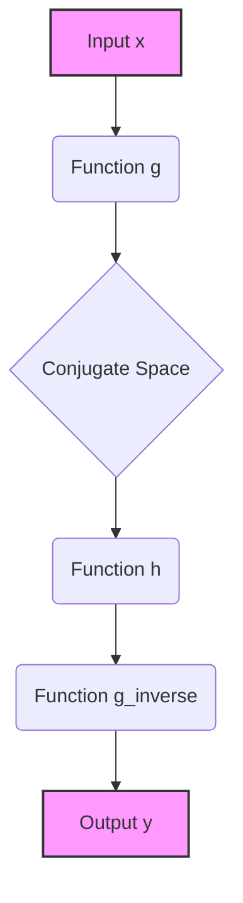

```mermaid
graph TD
    A[Input x] --> B(Function g);
    B --> C{Conjugate Space};
    C --> D(Function h);
    D --> E(Function g_inverse);
    E --> F[Output y];

    style A fill:#f9f,stroke:#333,stroke-width:2px;
    style F fill:#f9f,stroke:#333,stroke-width:2px;
```
