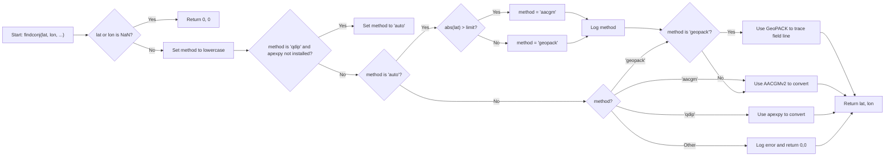
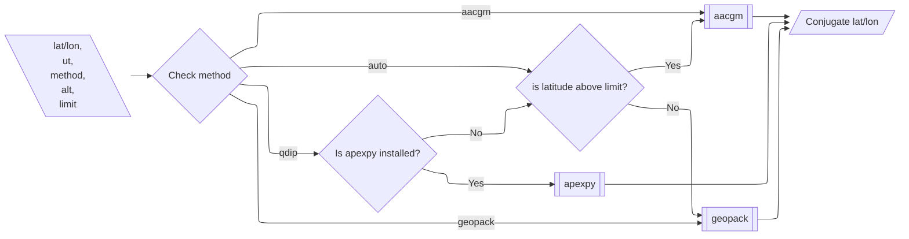
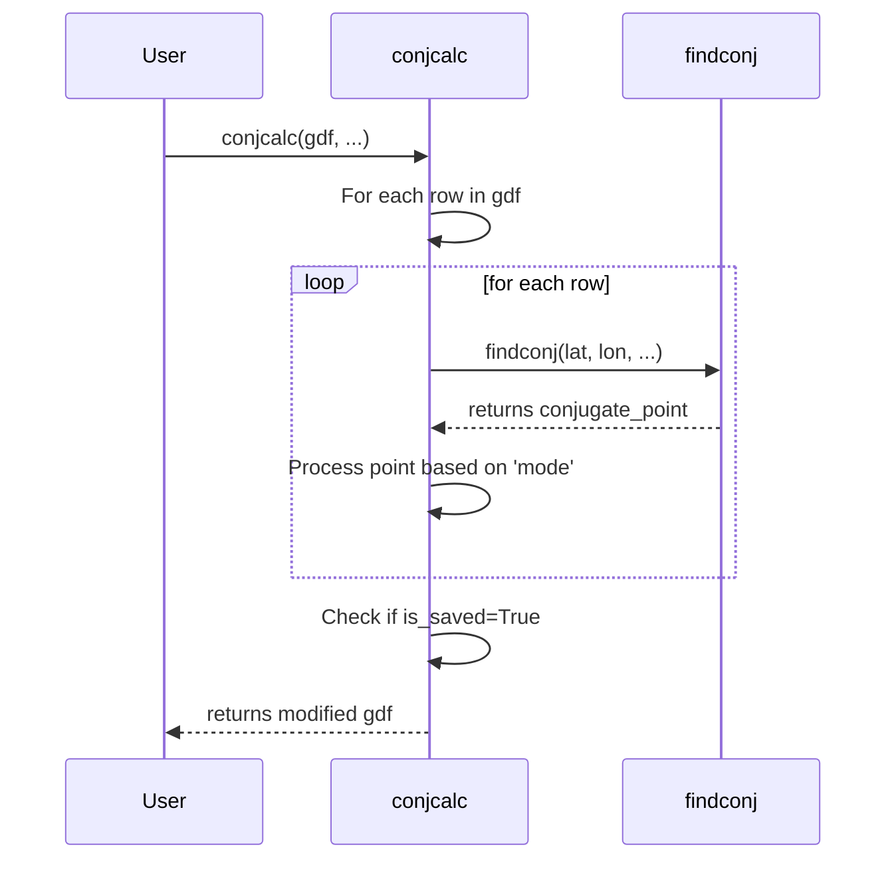
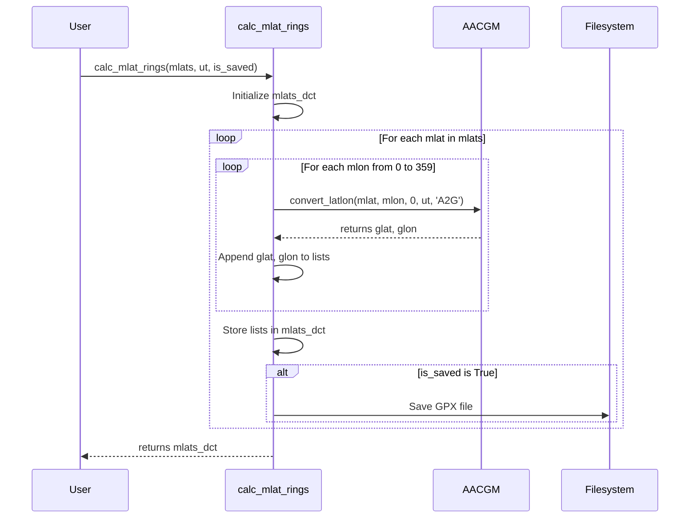

## `findconj'

Here's a flowchart that better addresses what the user's interested in.

## `conjcalc`

Here's a sequence diagram showing how conjcalc calls findconj.

## `calc_mlat_rings``

Sequence diagram showing how calc_mlat_rings calls aacgmv2:

