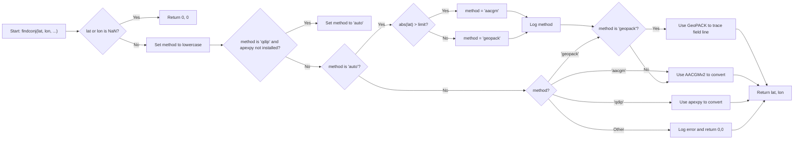
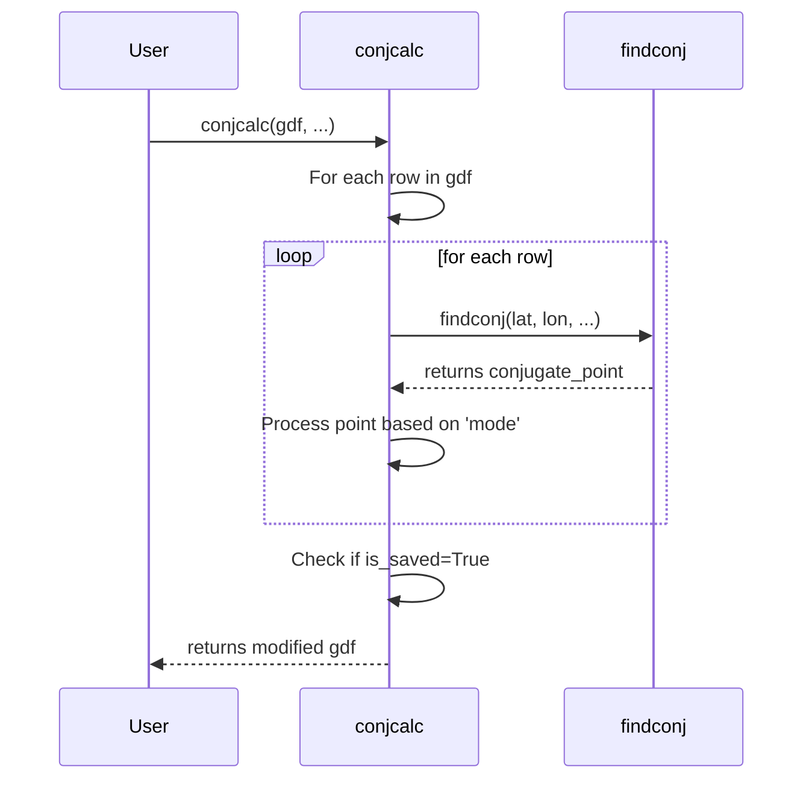
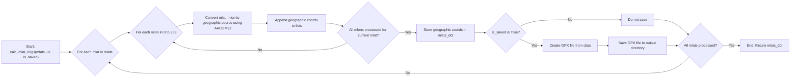
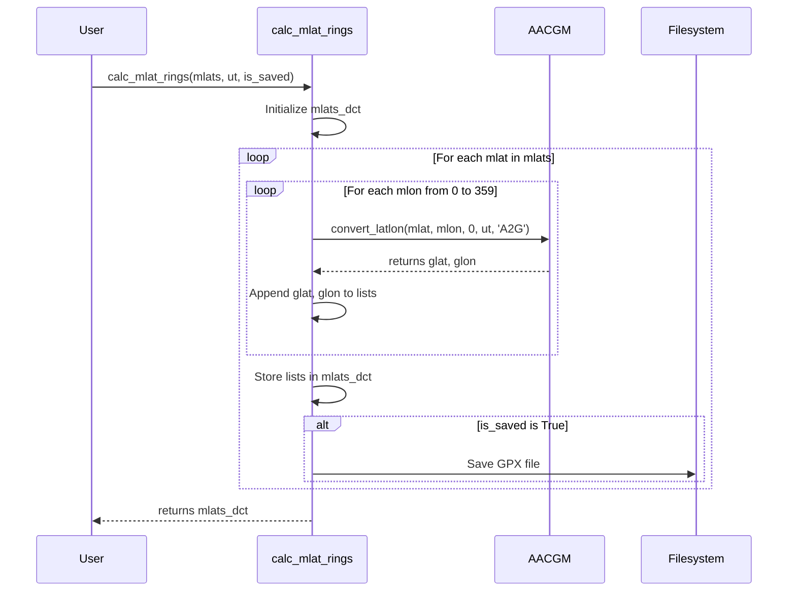

## `findconj'

```mermaid
graph LR
    A["Start: findconj(lat, lon, ...)"] --> B{"lat or lon is NaN?"};
    B -- "Yes" --> C["Return 0, 0"];
    B -- "No" --> D["Set method to lowercase"];
    
    D --> E{"method is 'qdip' and apexpy not installed?"};
    E -- "Yes" --> F["Set method to 'auto'"];
    E -- "No" --> G{"method is 'auto'?"};

    G -- "Yes" --> H{"abs(lat) > limit?"};
    H -- "Yes" --> I["method = 'aacgm'"];
    H -- "No" --> J["method = 'geopack'"];

    G -- "No" --> K{"method?"};
    I --> L["Log method"];
    J --> L;
    
    L --> M{"method is 'geopack'?"};
    K -- "'aacgm'" --> P["Use AACGMv2 to convert"];
    K -- "'geopack'" --> M;
    K -- "'qdip'" --> Q["Use apexpy to convert"];
    K -- "Other" --> R["Log error and return 0,0"];

    M -- "Yes" --> N["Use GeoPACK to trace field line"];
    M -- "No" --> P;
    
    N --> O["Return lat, lon"];
    P --> O;
    Q --> O;
    R --> O;
```

## `conjcalc`

```mermaid
graph LR
    A["Start: conjcalc(gdf, latname, ...)"] --> B["Initialize new columns"];
    
    B --> C{"Iterate through each row in gdf"};
    
    C --> D["Extract lat/lon from row"];
    D --> E{"lon/lat is string?"};
    E -- "Yes" --> F["Try to convert to float"];
    E -- "No" --> G;
    
    F --> G["Check if lon > 180"];
    G --> H["Call findconj(lat, lon, ...)"];
    H --> I["Store conjugate lat/lon in gdf"];

    I --> J{"Check hemisphere"};
    J -- "lat > 0" --> K["Handle Northern hemisphere"];
    J -- "lat <= 0" --> L["Handle Southern hemisphere"];
    
    K --> M{"mode in ('N2S', 'flip')?"};
    M -- "Yes" --> N["Set PLAT/PLON to conjugate coords"];
    M -- "No" --> O["Set PLAT/PLON to original coords"];
    
    L --> P{"mode in ('S2N', 'flip')?"};
    P -- "Yes" --> Q["Set PLAT/PLON to conjugate coords"];
    P -- "No" --> R["Set PLAT/PLON to original coords"];

    N --> S["Update gdf row"];
    O --> S;
    Q --> S;
    R --> S;

    S --> T{"All rows processed?"};
    T -- "No" --> C;
    
    T -- "Yes" --> U{"is_saved is True?"};
    U -- "Yes" --> V["Save gdf to CSV file"];
    U -- "No" --> W["Do not save"];
    
    V --> X["End: Return gdf"];
    W --> X;
```

Here's a sequence diagram.

```mermaid
sequenceDiagram
    User->>conjcalc: conjcalc(gdf, ...)
    conjcalc->>conjcalc: For each row in gdf
    loop for each row
        conjcalc->>findconj: findconj(lat, lon, ...)
        findconj-->>conjcalc: returns conjugate_point
        conjcalc->>conjcalc: Process point based on 'mode'
    end
    conjcalc->>conjcalc: Check if is_saved=True
    conjcalc-->>User: returns modified gdf
```

## `calc_mlat_rings``

```mermaid
graph LR
    A["Start: calc_mlat_rings(mlats, ut, is_saved)"] --> B{"For each mlat in mlats"};

    B --> C{"For each mlon in 0 to 359"};
    C --> D["Convert mlat, mlon to geographic coords using AACGMv2"];
    D --> E["Append geographic coords to lists"];
    
    E --> F{"All mlons processed for current mlat?"};
    F -- "No" --> C;
    
    F -- "Yes" --> G["Store geographic coords in mlats_dct"];
    
    G --> H{"is_saved is True?"};
    H -- "Yes" --> I["Create GPX file from data"];
    H -- "No" --> J["Do not save"];
    
    I --> K["Save GPX file to output directory"];
    J --> L{"All mlats processed?"};

    K --> L;
    L -- "No" --> B;
    L -- "Yes" --> M["End: Return mlats_dct"];
```

Sequence diagram:

```mermaid
sequenceDiagram

    User->>calc_mlat_rings: calc_mlat_rings(mlats, ut, is_saved)
    calc_mlat_rings->>calc_mlat_rings: Initialize mlats_dct
    loop For each mlat in mlats
        loop For each mlon from 0 to 359
            calc_mlat_rings->>AACGM: convert_latlon(mlat, mlon, 0, ut, 'A2G')
            AACGM-->>calc_mlat_rings: returns glat, glon
            calc_mlat_rings->>calc_mlat_rings: Append glat, glon to lists
        end
        calc_mlat_rings->>calc_mlat_rings: Store lists in mlats_dct
        alt is_saved is True
            calc_mlat_rings->>Filesystem: Save GPX file
        end
    end
    calc_mlat_rings-->>User: returns mlats_dct
```

