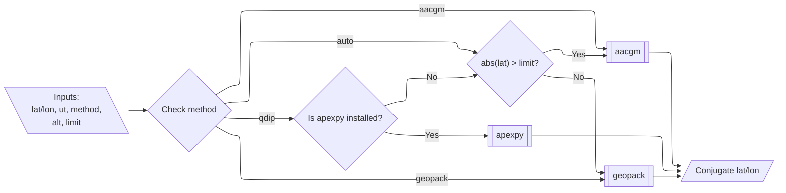
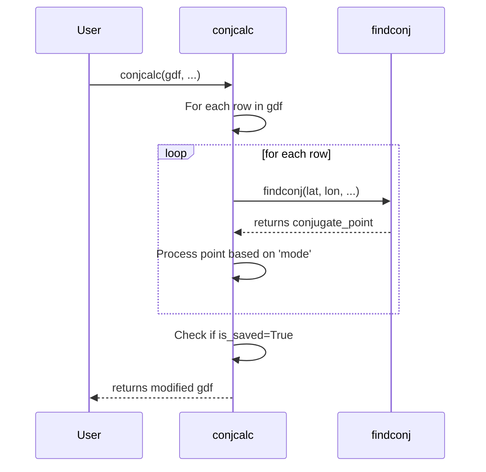
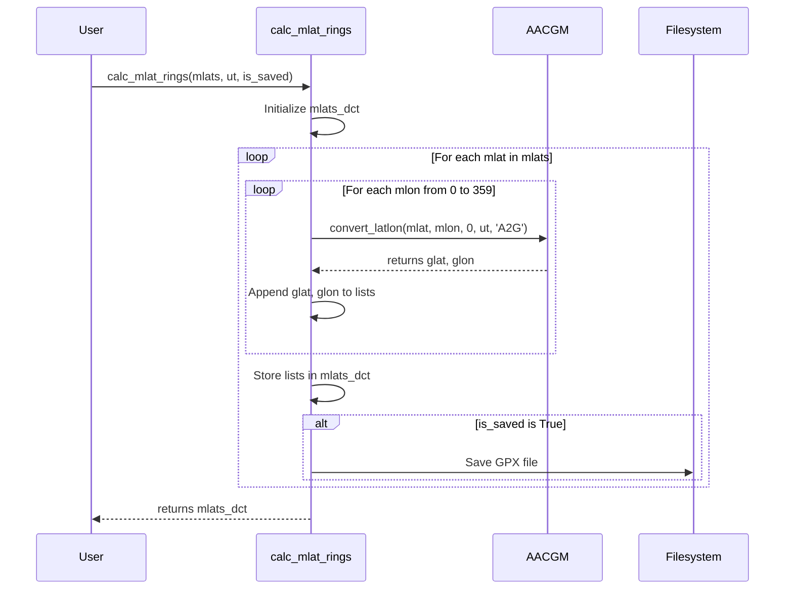

## `findconj'

```mermaid
---
config:
  layout: elk
---
graph LR
    Start@{ shape: lean-l, label: "Inputs:
    lat/lon, ut, method,
    alt, limit" }
    Start --> CheckMethod{Check method};
    CheckMethod -- auto --> autoq{"abs(lat) > limit?"};
    autoq-->|Yes| aacgm[[aacgm]]
    autoq-->|No| geopack[[geopack]]
    CheckMethod -- qdip --> qdipq{"Is apexpy installed?"};
    qdipq-->|Yes| apexpy[[apexpy]]
    qdipq-->|No| autoq
    CheckMethod -- aacgm --> aacgm;
    geopack --> output@{ shape: lean-r, label: "Conjugate lat/lon"}
    CheckMethod -- geopack --> geopack;
    aacgm --> output
    apexpy --> output

```

## `conjcalc`

Here's a sequence diagram showing how conjcalc calls findconj.

```mermaid
sequenceDiagram
    User->>conjcalc: conjcalc(gdf, ...)
    conjcalc->>conjcalc: For each row in gdf
    loop for each row
        conjcalc->>findconj: findconj(lat, lon, ...)
        findconj-->>conjcalc: returns conjugate_point
        conjcalc->>conjcalc: Process point based on 'mode'
    end
    conjcalc->>conjcalc: Check if is_saved=True
    conjcalc-->>User: returns modified gdf
```

## `calc_mlat_rings``

Sequence diagram showing how calc_mlat_rings calls aacgmv2:

```mermaid
sequenceDiagram

    User->>calc_mlat_rings: calc_mlat_rings(mlats, ut, is_saved)
    calc_mlat_rings->>calc_mlat_rings: Initialize mlats_dct
    loop For each mlat in mlats
        loop For each mlon from 0 to 359
            calc_mlat_rings->>AACGM: convert_latlon(mlat, mlon, 0, ut, 'A2G')
            AACGM-->>calc_mlat_rings: returns glat, glon
            calc_mlat_rings->>calc_mlat_rings: Append glat, glon to lists
        end
        calc_mlat_rings->>calc_mlat_rings: Store lists in mlats_dct
        alt is_saved is True
            calc_mlat_rings->>Filesystem: Save GPX file
        end
    end
    calc_mlat_rings-->>User: returns mlats_dct
```

